# XSS LAB

#### The objective of this lab activity is to complete 2 OWASP's Juice-Shop challenges:
#### 1.  Perform a DOM XSS attack
#### 2.  Perform a reflected XSS attack

## 1. Perform a DOM XSS attack:
### Perform a DOM XSS attack with <iframe src="javascript:alert(`xss`)">

The attack is performed in the search bar

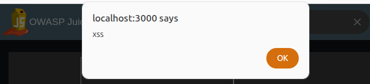

#### A new element is created:
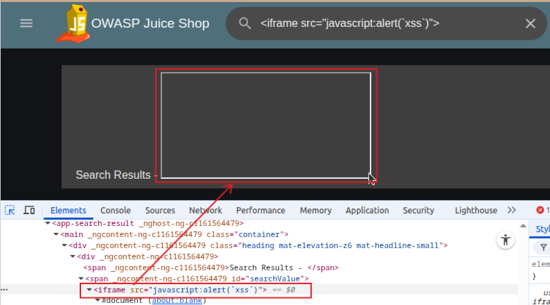

In the html we can see a new iframe with the alert, so the attack is successful and it is possible to exploit this vulnerability.

#### Code vulnerability:
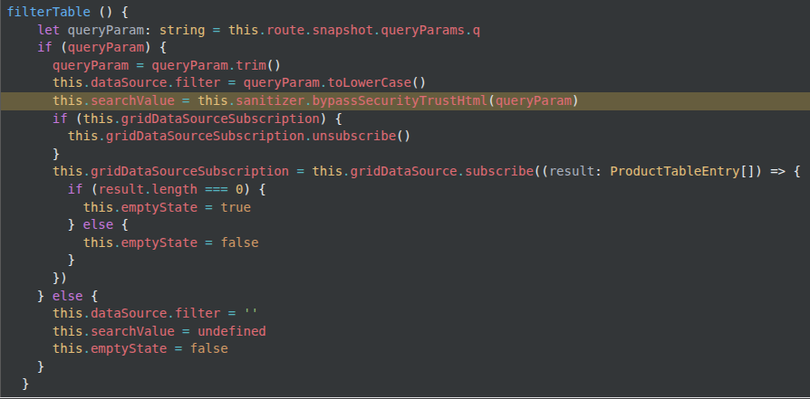

In this case we an see `this.searchValue = this.sanitizer.bypassSecurityTrustHtml(e)` which is an Angular feature that disables sanitization for specific content types (HTML in this casae). Improper usage can result in XSS vulnerabilities.
A simple solution is as simple as changing it in: `this.searchValue = e`

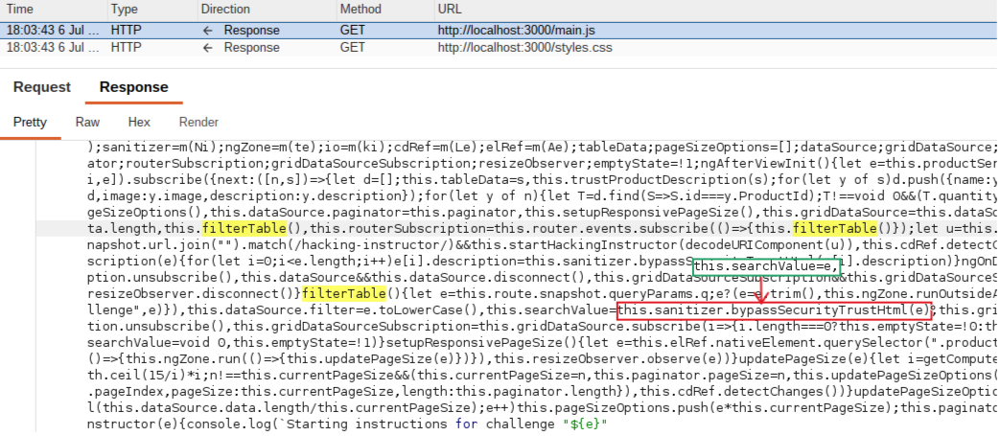

#### After applying this change the attack is no more successful:
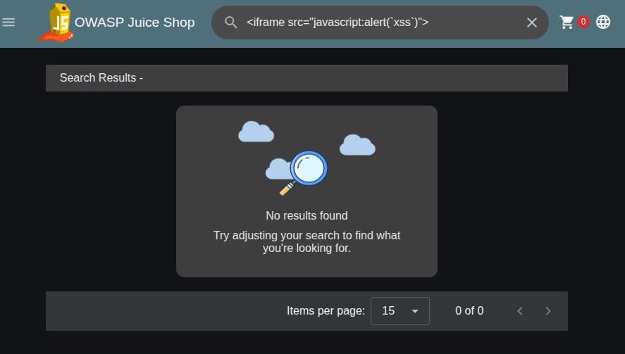

## 2.  Perform a reflected XSS attack

### 1. It is needed to find a user input that is sent to the server, which reflects it back in the HTTP response without proper sanitization, causing the browser to interpret and execute it as part of the returned HTML:
On Burp proxy it is possible to see that a request with the traking number is sent to the backend when searching for traking infomations on a specific id:
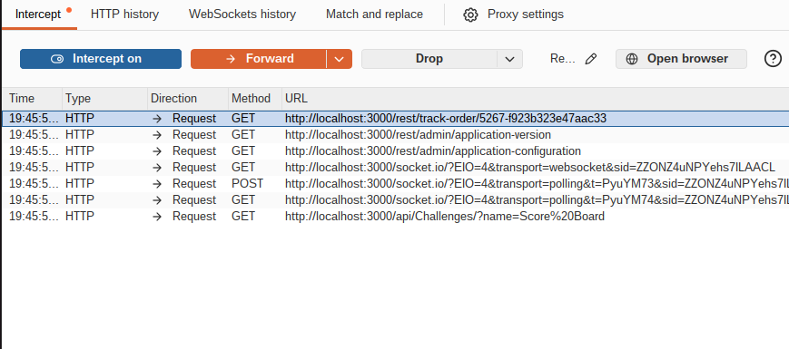

And the traking number ends up in the html:
#### When loading the page, before the backend call is executed this is the state of the page:

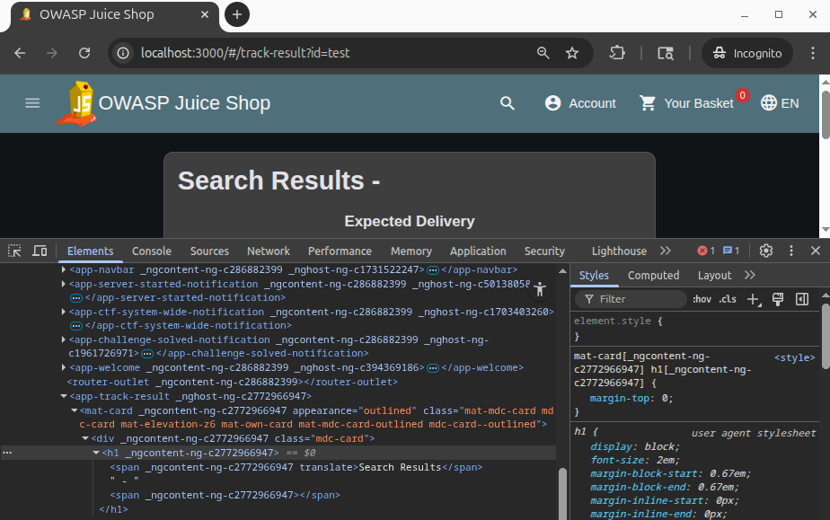

#### Than we encounter the backend call:

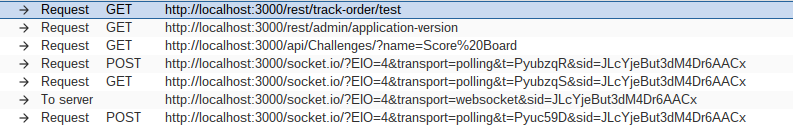

#### After fowarding the call:

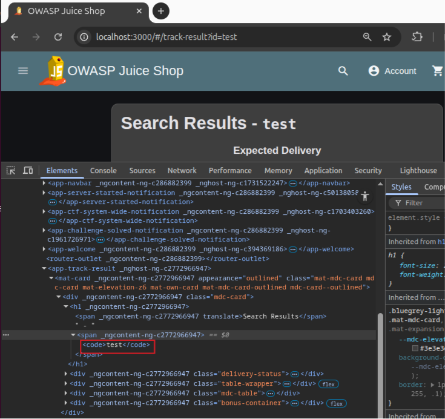

So the `test` text is loaded based on the response of the backend.

## Vulnerable Code:

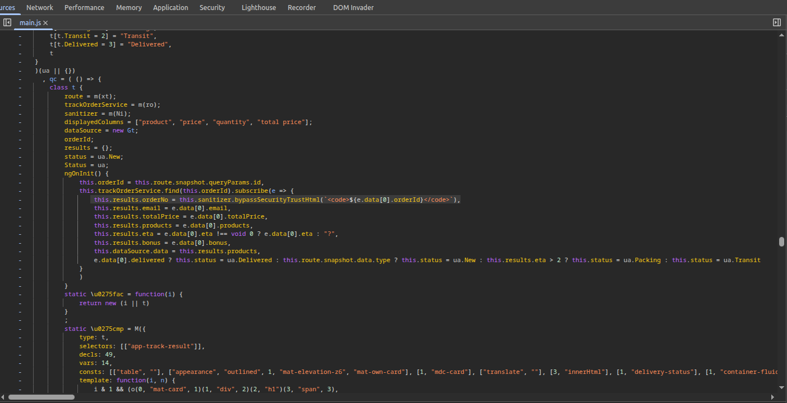

Similarly to before the code ***bypassSecurityTrustHtml(`<code>${e.data[0].orderId}</code>`),*** bypasses the Angular security check on user input, and the code is interpreted as html.

## Reflected XSS.1

By writing <iframe src="javascript:alert(`xss`)"> as tracking id we obtain a successful Reflected XSS:

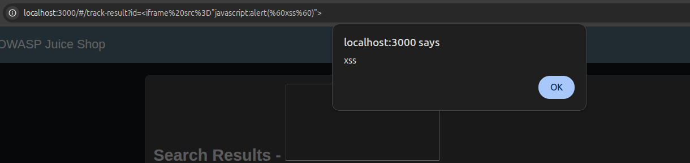

The difference from the DOM XSS is that in this case the &lt;code&gt;...&lt;/code&gt; element is rendered based on the data sent to the backend

## Another Reflected XSS:
Inside the Juice Shop web page there is also the Last Login IP section associated to an account. The last *login IP* is displayed in a <small> element. 

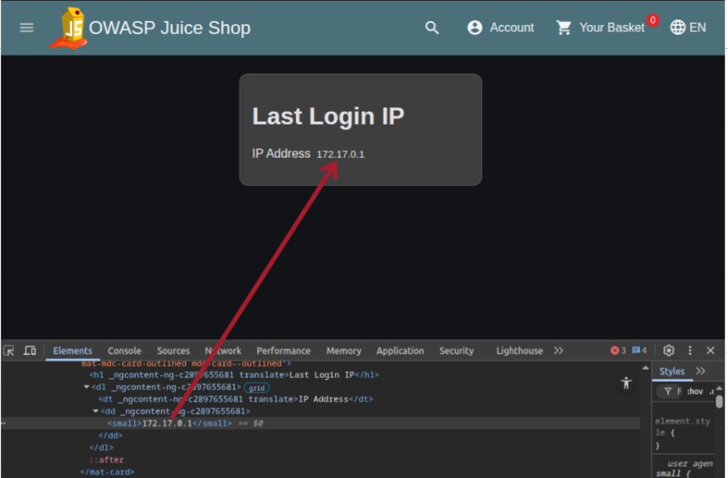

If it is possible to manipulate the IP that is registered inside the element, a Reflected XSS may possible.

### Analyzing traffic in Burp:
While logging out this request is encountered:

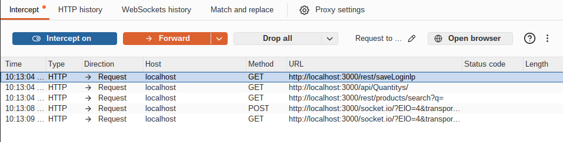
If the goal is to alter the IP value being stored, there are essentially two possible approaches. The `first approach` is to change the actual source IP address of the connection, for example by using a VPN or a proxy. However, this would only allow the use of a valid IP address and would not make it possible to inject arbitrary content, such as an HTML payload containing an <iframe>.

The `second approach` is to assume that the application is deployed behind a reverse *proxy* and that it obtains the client IP address from one of the HTTP headers commonly used in such configurations, such as X-Forwarded-For, X-Real-IP, or similar headers. Since it was not known which specific header the application trusted, I proceeded by testing several of the most common proxy-related headers with `Match and replace` feature on Burp:

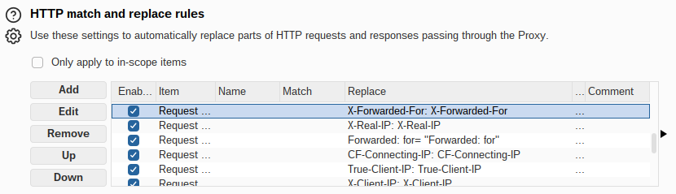

Now while logging out, if the backend accepts one of this headers i should be able to see it in the last login ip page, and i would know which header was the right one:

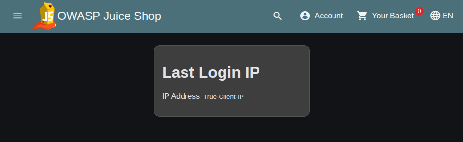

So the header used to communicate the IP is `True-Client-IP`

### Reflected XSS.2
At this point it is possible to insert the same iframe into the True-Client-IP Header:

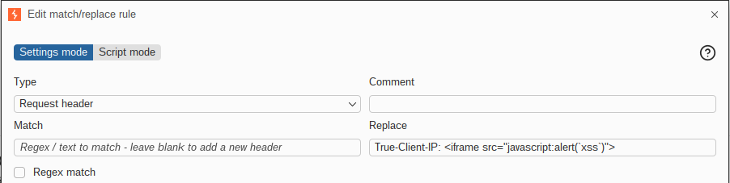

By logging out now the Reflected XSS is succesful

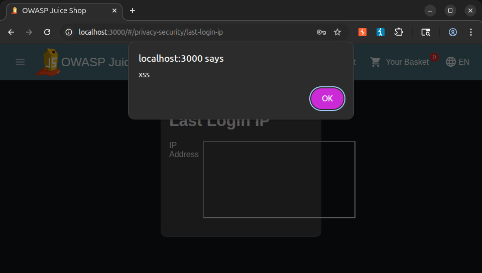

### Vulnerable Code:
To find the vulnerable code the keywords IP, logout, lastLogin were searched in the main.js file:

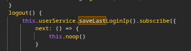

Logging out the saveLastLoginIp is called:

And we can find the vulnerable code in parseAuthToken:

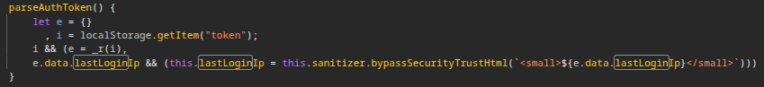

Here we find the `this.lastLoginIp = this.sanitizer.bypassSecurityTrustHtml(<small>${e.data.lastLoginIp}</small>))` that skips the checks on the lastLoginIp field
